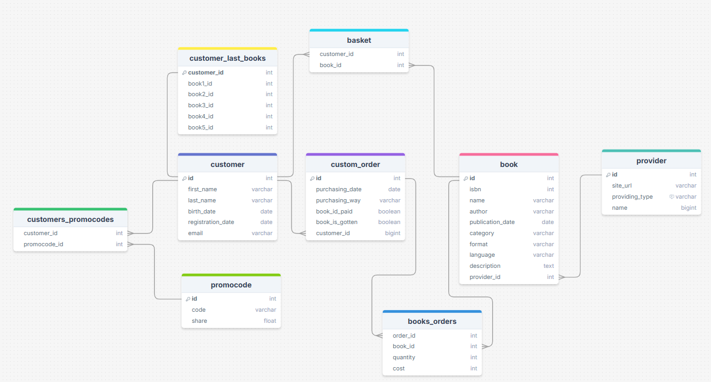

### Assignment 4

## Бізнес ідея

Інтернет магазин електронних книжок різного формату.
Клієнти, через клієнт-сервіс, будуть шукати, вибирати та замовляти електронні книги, які будуть зберігатися в профілі користувача після успішної оплати.
Книги будуть постачатись авторами, видавничими організаціями або агрегаторами.

База даних побудована для використання інтернет-магазин клієнтів,
які матимуть змогу зберігати дані повного циклу взаємодії із клієнтом.
Під час реєстрації, створюється новий користувач, який матиме можливість додати книгу до корзини та замовити її.

База даних підтримує, до прикладу, пошук книг, які найбільше продаються; коли було найбільше реєстрацій; книгу яку додають в корзину найбільше, але не купують.

Найважливіші ентіті:
* `customer` - дані про клієнта
* `custom_order` - замовлення клієнтів
* `book` - база всіх книг які є в магазині
* `provider` - всі постачальники книг (тип: author, aggregator, publishing house)

## Побудова БД

ERD

Для того щоб зберігати користувачів, я створив таблицю customers, яка є незалежною в інших таблиць.
Використовує 3 індекси: кластерний для індентифікатора, некластерний для електронної адреси та дати реєстрації.
Електронна адреса унікальна для всієї таблиці, тому для швидшого пошуку для перевірки на наявність пошти, використовується secondary індекc.
Індекс на колонку дати реєстрації використовується для запиту, який рахує кількість придбаних книг клієнтами, які зареєструвались за *останній рік*

Замовлення клієнтів зберігаються в таблиці `custom_order`, який має ідентифікатор користувача.
Зв'язок між таблицею для клієнтів та замовлень є як **1:many**. Один користувач може мати багато замовлень, але не навпаки.
Для `custom_order` існує 2 індекси: для primary key та користувача. Індекс для користувача потрібен щоб пришвидшити з'єднання між таблицею клієнта та його замовленням

Таблиця `book` зберігає інформацію про книгу. Має 3 індекси: для колонок primary key, ідентифікатора `provider` та назвою книги.
Індекс для колонки ім'я книги потрібен для швидкого пошуку на клієнті.

Між таблицями `custom_order` та `book` зв'язок many:many. Для цього я створив ще одну таблицю - `books_orders`.
Там відсутній primary key, але є дві колонки із ідентифікаторами для `custom_order` та `book`. В них відповідно є індекси.
В цій таблиці можуть буди декілька рядків із тим самим ідентифікатором таблиці із замовленням але різними книгами.
І навпаки, можуть бути декілька рядків із однаковим id таблиці книг, але різними id замовлень.

Таблиця `basket` має зв'язок як many:many між таблицею користувача та книгою. Відповідно й індекси.

Також many:many має зв'язок таблиця між `customer` та `promocodes`. Можливо багато різних промокодів для одного користувача і багато користувачів можуть мати один промокод.

Таблиця `customer_last_books` має зв'язок 1:1 із таблицею `customer`. Тобто для користувача буде тільки один відповідний рядок із таблиці.

Таблиця всіх індексів:

table_name	index_name	column_name
basket	book_id	book_id
basket	customer_id	customer_id
book	name_index	name
book	PRIMARY	id
book	provider_id	provider_id
custom_order	customer_id	customer_id
custom_order	PRIMARY	id
customer	email	email
customer	PRIMARY	id
customer	registration_date_index	registration_date
customer_last_books	book1_id	book1_id
customer_last_books	book2_id	book2_id
customer_last_books	book3_id	book3_id
customer_last_books	book4_id	book4_id
customer_last_books	book5_id	book5_id
customer_last_books	customer_id	customer_id
customers_promocodes	customer_id	customer_id
customers_promocodes	promocode_id	promocode_id
orders_books	book_id	book_id
orders_books	order_id	order_id
orders_books	order_id	book_id
promocode	PRIMARY	id
provider	PRIMARY	id